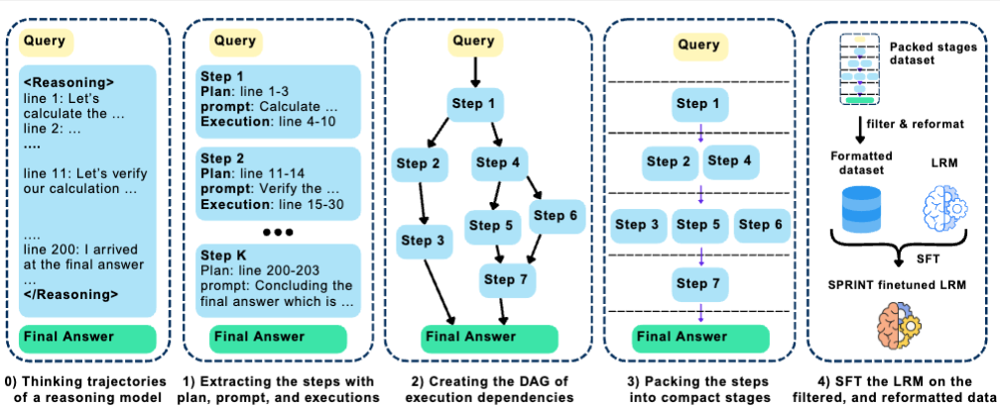
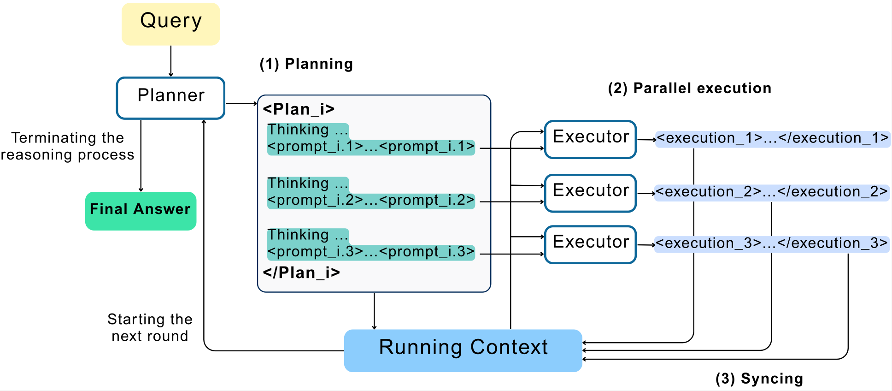

# SPRINT: Enabling Interleaved Planning and Parallelized Execution in Reasoning Models

## Overview
Large reasoning models (LRMs) excel at complex reasoning tasks but typically generate lengthy sequential chains-of-thought, resulting in long inference times before arriving at the final answer. To address this challenge, we introduce SPRINT, a novel post-training and inference-time framework designed to enable LRMs to dynamically identify and exploit opportunities for parallelization during their reasoning process. SPRINT incorporates an innovative data curation pipeline that reorganizes natural language reasoning trajectories into structured rounds of long-horizon planning and parallel execution. By fine-tuning LRMs on a small amount of such curated data, the models *learn* to dynamically identify independent subtasks within extended reasoning processes and effectively execute them in parallel. Through extensive evaluations, we show that the models fine-tuned with the SPRINT framework match the performance of reasoning models on complex domains such as mathematics while generating up to 39% fewer sequential tokens on problems requiring more than 8000 output tokens. Finally, we observe consistent results transferred to two out-of-distribution tasks of GPQA and Countdown with up to 45% and 65% reduction in average sequential tokens for longer reasoning trajectories, while achieving the performance of the fine-tuned reasoning model.

We recommend `python=3.11`. To install required packages, run
```
$ pip install -r requirements.txt
```

If you want to use FlashInfer backend with vLLM, please refer to this guide: https://github.com/flashinfer-ai/flashinfer

Before running the code, please make sure to set the following environment variables in `.env` file:
- `OPENAI_API_KEY`: OpenAI API key for using OpenAI models.
- `LOGS_DIR`: Directory to save logs and outputs.

## Directory Structure

- `src`: Source code for the data curation pipeline and SPRINT inference
  - `src/component_separation`: Code for component separation
  - `src/dag_creation`: Code for DAG creation
  - `src/finetuning_data_preparation`: Code for preparing finetuning data
  - `src/base_model_evaluation`: Code for RFT model inference
  - `src/agent_orchestration`: Code for SPRINT inference
  - `src/prompts`: Prompts used for all LLM calls.
  - `src/utils`: Utility functions for text processing, evaluating results, and making API calls to models.
- `run`: Bash scripts for running the data curation pipeline, model training and SPRINT inference. 
- `logs`: Logs created from running the data curation pipeline on a few problems from the MATH500 benchmark
- `logs_full_trajectory`: Logs created from running SPRINT inference on a few problems from the MATH500 benchmark

## Data Curation



### 1) Component separation

Set the following variables in `run_component_separation.sh`
- `COMPONENT_SEPARATION_MODEL`: Name of the model to use for component separation
- `RANGE`: Range of problems to run component separation on. Set it to ":" to run on all problems.
- `DATA_HUB_PATH`: HuggingFace hub path of the dataset containing reasoning trajectories to run component separation on. The reasoning traces must be in a column labeled `thought`.
- `SUBSET`: Subset of the above HuggingFace dataset to use.
- `NUM_WORKERS`: Number of workers to use for component separation.

```
$ sh run/run_component_separation.sh
```

### 2) DAG creation
- `DAG_CREATION_MODEL`: Name of the model to use for DAG creation.

```
$ sh run/run_dag_creation.sh
```

### 3) Packing and Finetuning data preparation

```
$ sh run/run_finetuning_data_preparation.sh
```

### 4) Model Training (SFT)

To perform full fine-tuning of a 7B model, run the following command:
``` 
$ sh run/run_finetune.sh
```

## SPRINT Inference



To run SPRINT over a dataset, serve the model using vLLM and use the following variables in `run_agent_orchestration.sh` to configure the run:

- `PLANNER_MODEL` and `EXECUTOR_MODEL`: Name of the served model. Typically, the same model is used to generate both plans and executions. 
- `PLANNER_SERVER_URL` and `EXECUTOR_SERVER_URL`: URL of the vLLM server where the model is served.
- `TEST_HUB_PATH`: HuggingFace hub path of the test set to run evaluation on
- `ORCHESTRATION_SPLIT`: Split of the HuggingFace dataset used for evaluation. For HuggingFace datasets that do not specify a split, set it to `default`.
- `TEST_SUBSET`: Subset of the above HuggingFace dataset to use.
- `ORCHESTRATION_RANGE`: Range of problems to run evaluation on. Set it to ":" to run on all problems. 
- `MAX_PHASES`: Maximum number of iterative plan and execution stages the model is allowed to iterate over before arriving at the final answer. 

Finally, run the following command
```
$ sh run/run_agent_orchestration.sh
```

## Evaluation

Each evaluation of SPRINT creates a folder within `LOGS_DIR`. The folder contains `agent_orchestration_output.csv` which summarizes the results from all evaluated problems. The folder also contains a `.txt` file for each problem indicating the full trajectory of plans and executions created by SPRINT for that problem. 

To evaluate results, update the folder_path below and run the following code to get accuracy and sequential token count:
```python
import sys, os
import pandas as pd
sys.path.append("src/utils/")
import evaluate_utils

folder_path = "..."
output_df = pd.read_csv(os.path.join(folder_path, "agent_orchestration_output.csv"))
accuracy = evaluate_utils.get_eval_metrics(output_df)[0]
sequential_token_count = evaluate_utils.get_seq_token_counts(folder_path)
print(f"Accuracy: {accuracy}, Sequential token count: {sequential_token_count}")
```
